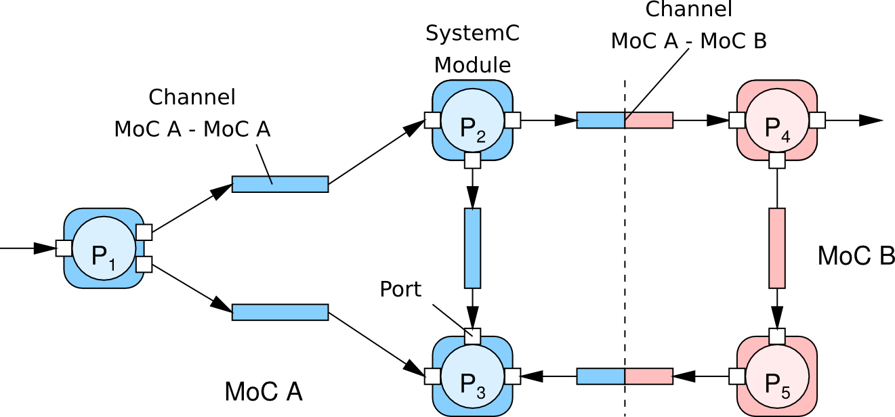

# The SystemC ForSyDe 

ForSyDe-SystemC uses the [SystemC](www.accellera.org/downloads/standards/systemc) class library to implement ForSyDe.

An intermediate representation of ForSyDe models based on XML and C++ files, called ForSyDe-XML, can be used for development of analysis and synthesis backends.
Currently, ForSyDe-SystemC can generate this intermediate representation by means of introspection.

## Getting the Tools 
The latest version of our supporting modeling libraries and development tools can be obtained from the [repository]({{ site.github.repository_url }}) or by clicking on the download button above. If you are interested in a specific release, check the [releases](https://github.com/forsyde/ForSyDe-SystemC/releases) section of the repository.

## Installation and usage

Following the link, you can find instructions on [setting up ForSyDe-SystemC on your machine](setup.html).

## Documentation

You can find additional documentation on ForSyDe-SystemC by following links below:

* [SY MoC Tutorial](sy-tutorial.html): a small example of modeling a synchronous process network in ForSyDe-SystemC.
* [API documentation](api/index.html): extended documentation generated with Doxygen. 
